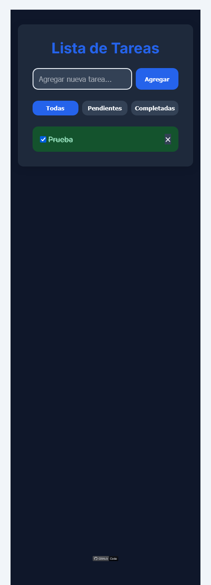

# 📝 Quick To-Do List

Una aplicación simple, rápida y responsiva para gestionar tareas diarias. Diseñada con enfoque **Mobile First**, permite agregar, completar, eliminar y filtrar tareas, además de soportar **modo oscuro**.

GitHub Pages Demo: https://emiliano-blackbird.github.io/quick-to-do-list/

## Características

- ✅ Añadir y eliminar tareas con animaciones
- 🌗 Alternar entre modo claro y oscuro
- 📁 Guardado persistente en `localStorage`
- 🔍 Filtros: todas, completadas y pendientes
- 📱 Diseño responsivo (mobile first)
- 💾 Compatible como App PWA (instalable)
- 👆 Swipe en móviles para borrar tareas

## Tecnologías

- HTML5 + CSS3 (con variables y animaciones)
- JavaScript (POO)
- LocalStorage
- Font Awesome
- Google Fonts (`Exo`, `Inter`)
- Service Worker
- PWA Manifest

## Capturas





## Cómo usar

1. Cloná el repositorio:
   ```bash
   git clone https://github.com/Emiliano-Blackbird/quick-to-do-list.git
   cd quick-to-do-list

2. Abrilo en tu navegador:

    Solo abrí el index.html desde cualquier servidor local.

    O usá Live Server en VS Code.

📲 Instalar como App

Al abrir en tu móvil, se puede instalar como aplicación gracias al soporte de PWA. Ideal para acceso rápido a tus tareas.
🧠 Autor

## 👨‍💻 Author

    Emiliano Perez Paponi
    Full Stack Developer
    GitHub: @Emiliano-Blackbird
    Mail: EmilianoPerezPaponi@gmail.com